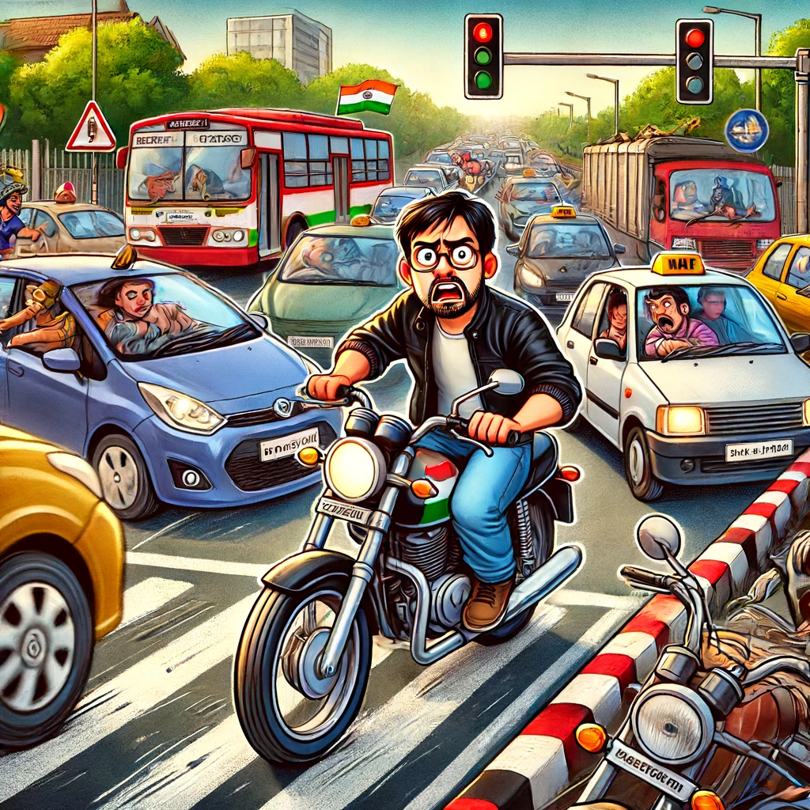
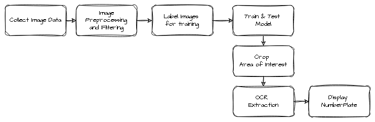
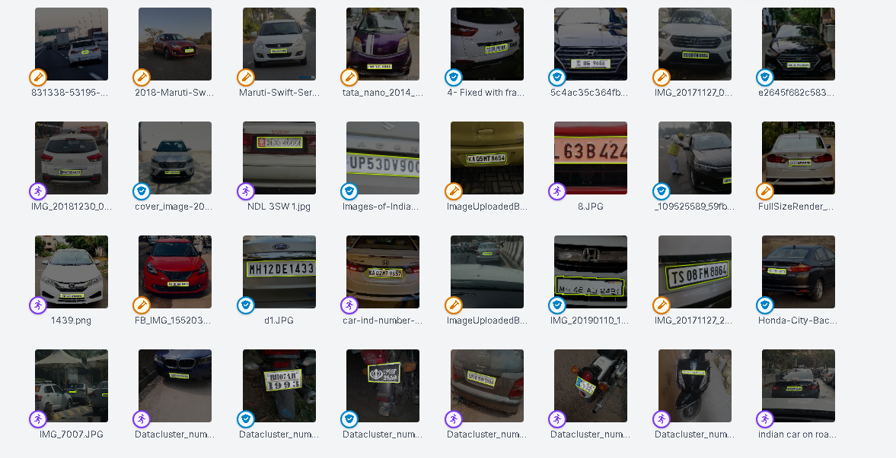

# Number Plate Detection 
## Background
As a biker navigating the chaotic streets of India, I’ve faced countless challenges that often left me feeling frustrated and vulnerable. There were days when reckless drivers would zoom past me, ignoring traffic signals and putting everyone at risk. I remember a particularly harrowing incident where a car ran a red light, barely missing me by inches. The fear and helplessness I felt in that moment made me acutely aware of the dire need for better traffic management and safety measures in our country.

These personal experiences have shown me how crucial it is to have an efficient system for detecting number plates. Here’s why:

**Traffic Violations**:  Efficient number plate detection helps identify and penalize vehicles involved in speeding, signal jumping, and other traffic violations, ensuring that offenders are held accountable and deterring future violations.

**Congestion Management**: By tracking vehicle movements, authorities can better manage traffic flow and reduce congestion in busy areas, making daily commutes smoother and less stressful for everyone.

**Stolen Vehicle Recovery:** Quick detection and identification of stolen vehicles become possible, aiding law enforcement in recovering them swiftly and reducing the financial and emotional burden on victims.
Parking Enforcement: Illegal parking can be curbed, freeing up space and maintaining order on crowded streets, which is especially important in densely populated areas.

**Accident Investigation**: In case of accidents, number plate detection provides crucial information for investigations, helping determine fault and speeding up legal processes, offering justice and closure to those affected.

**Enhanced Security**: Monitoring suspicious vehicles and tracking their movements can help prevent and respond to potential security threats, contributing to a safer community.

These daily encounters with the chaos and dangers of Indian traffic have motivated me to work on a project focused on efficient number plate detection. I am determined to contribute to a safer and more orderly traffic system, hoping to make a real difference in the lives of fellow commuters and ensure that the roads we travel are secure and well-regulated.

## System Design 

### Image Collection 
We collected all images from google images , we only wanted images of cars in Indian roads. To scrap the data we used 
simple image downloaded which is python package to download images, using google images search. We tested with alot of different keywords to find the extact type of images that we wanted for the project. Once we have the list of the keyword that suits our need we us the "downloadimages.py" script to download all the images. 

### Preprocessing
 Not all the images will be good for train and fight have duplicated data along the way, whcih needs to be removed before traing the data. 

### Labeling images 
 The important step in objec t recognition is to label the Area of Interesting using a Labeling tool. When we started the project we used Labelstudio for labeling the images , so that we can train the Yolo V7 model on the labeled images. 

 The idea was later discarded and roboflow platform was used as its API allow direct intregration in Jupyter Notebook to train YOLO V8 model. 

 
