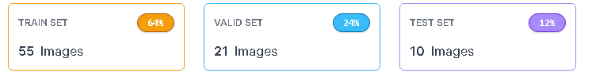
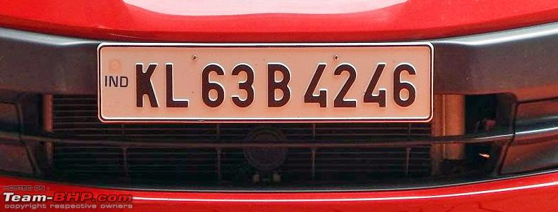
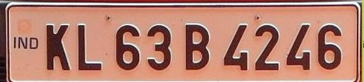
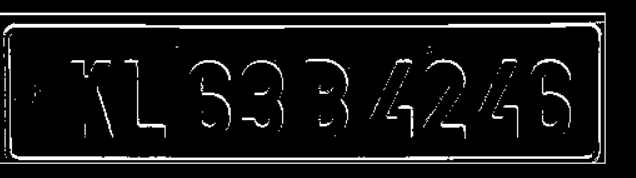

# Number Plate Detection 

## Background

As a biker navigating the chaotic streets of India, I’ve faced countless challenges that often left me feeling frustrated and vulnerable. There were days when reckless drivers would zoom past me, ignoring traffic signals and putting everyone at risk. I remember a particularly harrowing incident where a car ran a red light, barely missing me by inches. The fear and helplessness I felt in that moment made me acutely aware of the dire need for better traffic management and safety measures in our country.

These personal experiences have shown me how crucial it is to have an efficient system for detecting number plates. Here’s why:

**Traffic Violations**:  Efficient number plate detection helps identify and penalize vehicles involved in speeding, signal jumping, and other traffic violations, ensuring that offenders are held accountable and deterring future violations.

**Congestion Management**: By tracking vehicle movements, authorities can better manage traffic flow and reduce congestion in busy areas, making daily commutes smoother and less stressful for everyone.

**Stolen Vehicle Recovery:** Quick detection and identification of stolen vehicles become possible, aiding law enforcement in recovering them swiftly and reducing the financial and emotional burden on victims.
Parking Enforcement: Illegal parking can be curbed, freeing up space and maintaining order on crowded streets, which is especially important in densely populated areas.

**Accident Investigation**: In case of accidents, number plate detection provides crucial information for investigations, helping determine fault and speeding up legal processes, offering justice and closure to those affected.

**Enhanced Security**: Monitoring suspicious vehicles and tracking their movements can help prevent and respond to potential security threats, contributing to a safer community.

These daily encounters with the chaos and dangers of Indian traffic have motivated me to work on a project focused on efficient number plate detection. I am determined to contribute to a safer and more orderly traffic system, hoping to make a real difference in the lives of fellow commuters and ensure that the roads we travel are secure and well-regulated.

## System Design 

### Image Collection 
We collected all images from Google Images, specifically focusing on cars on Indian roads. To scrape the data, we used the Simple Image Download, a Python package for downloading images via Google Image search. We tested various keywords to find the exact type of images needed for the project. Once we had the list of suitable keywords, we used the "downloadimages.py" script to download all the images.

### Preprocessing
Not all images are suitable for training, and duplicate data needs to be removed before training.

### Labeling Images 
A crucial step in object recognition is labeling the area of interest using a labeling tool. Initially, we used LabelStudio for labeling the images to train the YOLO V7 model. Later, we switched to the Roboflow platform due to its API integration with Jupyter Notebook for training the YOLO V8 model.

The dataset was created with 86 images.

### Training the Model 
The dataset was imported into Google Colab and trained using the YOLO V8 model on a GPU.
*Tip:* Free GPU resources can get exhausted, so train and save the model, then use a CPU for local inferences.

### Running the Model Locally 
Once the model is trained, it can be used locally to compute inferences. The model can detect number plates with an accuracy of 98.8%.

### Cropping the Area of Interest 
Once the number plate is detected, it is cropped and saved in the cropped image directory.

### Preprocessing for OCR 
We use the open-source tool Tesseract to extract characters from the number plate. Tesseract works efficiently with some preprocessing, so we incorporated a small preprocessing pipeline.

### Extract Information Using Tesseract 
After processing, the images can be used with Tesseract to display the number plate information.
